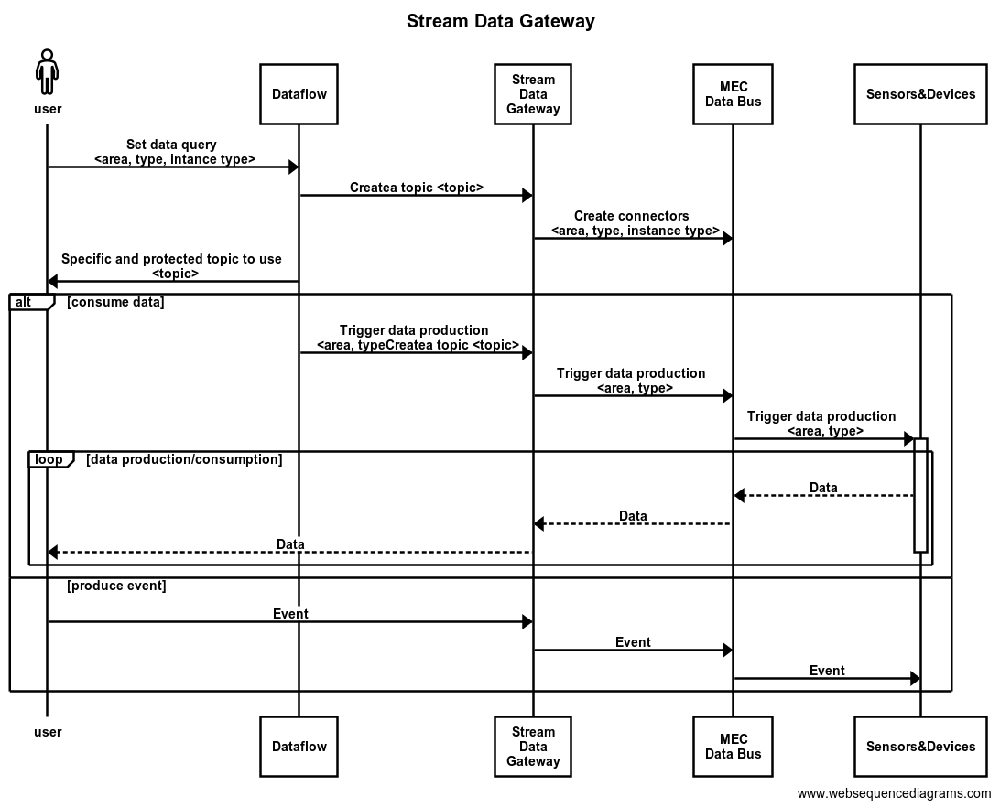

# Stream Data Gateway 

## Overview
This project contains all the components and connectors necessary to retrieve data from MEC data pipelines and make them accessible to consumers in internet through the 5GMETA Cloud platform.

*IMPORTANT*: 
- This branch contains the Keycloak-based topic authorization feature.
- It is mandatory to configure the Kafka clients with the following properties:
```
    security.protocol=SASL_PLAINTEXT
    sasl.mechanism=OAUTHBEARER
    sasl.jaas.config=org.apache.kafka.common.security.oauthbearer.OAuthBearerLoginModule required \
      oauth.refresh.token="<refresh token>" \
      oauth.client.id="<client_id>" \
      oauth.client.secret="<client_secret>" \
      oauth.token.endpoint.uri="http://<keycloak>/realms/demo/protocol/openid-connect/token";
    sasl.login.callback.handler.class=io.strimzi.kafka.oauth.client.JaasClientOauthLoginCallbackHandler
```

Thus, the Stream Data Gatawey module contains:

- Kafka Broker docker-compose and helm chart(in progress) (src/)
    - dev-version
        - dockers
        - run on your own server
        - sudo docker-compose up -d
        - open http://<ip>:8080
            * admin/admin
    - prod-version
        - kubernetes
- Connectors configuration to retrive the messages from ActiveMQ (src/)
- An example of Kafka Consumer (examples/)
    - consumer



## Deployment of the Cloud data bus
The deployment process of the 5GMETA Cloud data bus based on Kafka is described in [deploy](https://github.com/5gmeta/stream-data-gateway/tree/main/deploy) folder.

## Examples to poduce events and consume all different data-types
Skeletons and saple codes to guide the integration of data applications with the 5GMETA Cloud Plaform including the different data types and events can be found in [examples](https://github.com/5gmeta/stream-data-gateway/tree/main/examples) folder.

## Adding Strimzi OAuth to Kafka confluentinc

Strimzi Kafka OAuth provides token-based authorization using Keycloak as authorization server, and taking advantage of [Keycloak Authorization Services](https://www.keycloak.org/docs/latest/authorization_services/).

### Building

    git clone https://github.com/strimzi/strimzi-kafka-oauth.git
    mvn clean install

### Installing

Copy the following jars into your Kafka `libs` directory (`cp-base-new` and/or `kafka`) under `/usr/share/java/`:

    oauth-common/target/kafka-oauth-common-*.jar
    oauth-server/target/kafka-oauth-server-*.jar
    oauth-server-plain/target/kafka-oauth-server-plain-*.jar
    oauth-keycloak-authorizer/target/kafka-oauth-keycloak-authorizer-*.jar
    oauth-client/target/kafka-oauth-client-*.jar
    oauth-common/target/lib/nimbus-jose-jwt-*.jar
    oauth-server/target/lib/json-path-*.jar
    oauth-server/target/lib/json-smart-*.jar
    oauth-server/target/lib/accessors-smart-*.jar

Using volumes properties in docker compose file:

    volumes:
      - /etc/ssl/certs/docker/:/etc/ssl/certs/docker/
      - /home/meta/jar-for-kafka/kafka-oauth-common-1.0.0-SNAPSHOT.jar:/usr/share/java/cp-base-new/kafka-oauth-common-1.0.0-SNAPSHOT.jar
      - /home/meta/jar-for-kafka/kafka-oauth-keycloak-authorizer-1.0.0-SNAPSHOT-javadoc.jar:/usr/share/java/cp-base-new/kafka-oauth-keycloak-authorizer-1.0.0-SNAPSHOT-javadoc.jar
      - /home/meta/jar-for-kafka/kafka-oauth-common-1.0.0-SNAPSHOT-sources.jar:/usr/share/java/cp-base-new/kafka-oauth-common-1.0.0-SNAPSHOT-sources.jar
      - /home/meta/jar-for-kafka/accessors-smart-2.4.9.jar:/usr/share/java/cp-base-new/accessors-smart-2.4.9.jar
      - /home/meta/jar-for-kafka/kafka-oauth-server-plain-1.0.0-SNAPSHOT.jar:/usr/share/java/cp-base-new/kafka-oauth-server-plain-1.0.0-SNAPSHOT.jar
      - /home/meta/jar-for-kafka/kafka-oauth-server-plain-1.0.0-SNAPSHOT-javadoc.jar:/usr/share/java/cp-base-new/kafka-oauth-server-plain-1.0.0-SNAPSHOT-javadoc.jar
      - /home/meta/jar-for-kafka/kafka-oauth-server-plain-1.0.0-SNAPSHOT-sources.jar:/usr/share/java/cp-base-new/kafka-oauth-server-plain-1.0.0-SNAPSHOT-sources.jar
      - /home/meta/jar-for-kafka/kafka-oauth-client-1.0.0-SNAPSHOT-sources.jar:/usr/share/java/cp-base-new/kafka-oauth-client-1.0.0-SNAPSHOT-sources.jar
      - /home/meta/jar-for-kafka/kafka-oauth-keycloak-authorizer-1.0.0-SNAPSHOT.jar:/usr/share/java/cp-base-new/kafka-oauth-keycloak-authorizer-1.0.0-SNAPSHOT.jar
      - /home/meta/jar-for-kafka/json-path-2.8.0.jar:/usr/share/java/cp-base-new/json-path-2.8.0.jar
      - /home/meta/jar-for-kafka/kafka-oauth-server-1.0.0-SNAPSHOT.jar:/usr/share/java/cp-base-new/kafka-oauth-server-1.0.0-SNAPSHOT.jar
      - /home/meta/jar-for-kafka/kafka-oauth-client-1.0.0-SNAPSHOT.jar:/usr/share/java/cp-base-new/kafka-oauth-client-1.0.0-SNAPSHOT.jar
      - /home/meta/jar-for-kafka/kafka-oauth-keycloak-authorizer-1.0.0-SNAPSHOT-sources.jar:/usr/share/java/cp-base-new/kafka-oauth-keycloak-authorizer-1.0.0-SNAPSHOT-sources.jar
      - /home/meta/jar-for-kafka/nimbus-jose-jwt-9.31.jar:/usr/share/java/cp-base-new/nimbus-jose-jwt-9.31.jar
      - /home/meta/jar-for-kafka/json-smart-2.4.10.jar:/usr/share/java/cp-base-new/json-smart-2.4.10.jar
      - /home/meta/jar-for-kafka/kafka-oauth-server-1.0.0-SNAPSHOT-sources.jar:/usr/share/java/cp-base-new/kafka-oauth-server-1.0.0-SNAPSHOT-sources.jar
      - /home/meta/jar-for-kafka/kafka-oauth-server-1.0.0-SNAPSHOT-javadoc.jar:/usr/share/java/cp-base-new/kafka-oauth-server-1.0.0-SNAPSHOT-javadoc.jar
      - /home/meta/jar-for-kafka/kafka-oauth-common-1.0.0-SNAPSHOT-javadoc.jar:/usr/share/java/cp-base-new/kafka-oauth-common-1.0.0-SNAPSHOT-javadoc.jar
      - /home/meta/jar-for-kafka/kafka-oauth-client-1.0.0-SNAPSHOT-javadoc.jar:/usr/share/java/cp-base-new/kafka-oauth-client-1.0.0-SNAPSHOT-javadoc.jar

### Configuration of kafka confluentinc services

When your application connects to your authorization server, it should always use a secure connection - `https://`.
That goes for the Kafka Brokers, as well as for the Kafka clients.

Also SASL (Simple Authentication and Security Layer) with SSL (Secure Sockets Layer) should be used for securing network communication.

Below the configuration to activate `SASL_SSL` and `https` for each confluentinc service:

#### Broker

          environment:
            KAFKA_LISTENER_SECURITY_PROTOCOL_MAP: REPLICATION:SASL_SSL,CLIENT:SASL_SSL
            KAFKA_LISTENERS: CLIENT://0.0.0.0:9092,REPLICATION://0.0.0.0:9093
            KAFKA_ADVERTISED_LISTENERS: CLIENT://broker:9092,REPLICATION://broker:9093
            KAFKA_SECURITY_PROTOCOL: SASL_SSL
            KAFKA_SSL_KEYSTORE_LOCATION: /etc/ssl/certs/docker/broker1.jks
            KAFKA_SSL_KEYSTORE_PASSWORD: <password>
            KAFKA_SSL_KEY_PASSWORD: <password>
            KAFKA_SSL_TRUSTSTORE_LOCATION: /etc/ssl/certs/docker/truststore.jks
            KAFKA_SSL_TRUSTSTORE_PASSWORD: <password>
            KAFKA_SSL_KEYSTORE_TYPE: JKS
            KAFKA_SSL_TRUSTSTORE_TYPE: JKS
            #KAFKA_SSL_ENDPOINT_IDENTIFICATION_ALGORITHM: none
            KAFKA_SSL_CLIENT_AUTH: required
            KAFKA_INTER_BROKER_LISTENER_NAME: REPLICATION
            KAFKA_SASL_ENABLED_MECHANISMS: OAUTHBEARER
            KAFKA_SASL_MECHANISM_INTER_BROKER_PROTOCOL: OAUTHBEARER
            KAFKA_LISTENER_NAME_CLIENT_OAUTHBEARER_SASL_JAAS_CONFIG: >
                    org.apache.kafka.common.security.oauthbearer.OAuthBearerLoginModule required
                    oauth.valid.issuer.uri="https://keycloak:8443/realms/demo"
                    oauth.ssl.truststore.location="/etc/ssl/certs/docker/truststore.jks"
                    oauth.ssl.truststore.password="<password>"
                    oauth.jwks.endpoint.uri="https://keycloak:8443/realms/demo/protocol/openid-connect/certs"
                    oauth.username.claim="preferred_username"
                    unsecuredLoginStringClaim_sub="unused";
            KAFKA_LISTENER_NAME_REPLICATION_OAUTHBEARER_SASL_JAAS_CONFIG: >
                    org.apache.kafka.common.security.oauthbearer.OAuthBearerLoginModule required
                    oauth.client.id="kafka"
                    oauth.client.secret="<secret>"
                    oauth.ssl.truststore.location="/etc/ssl/certs/docker/truststore.jks"
                    oauth.ssl.truststore.password="<password>"
                    oauth.token.endpoint.uri="https://keycloak:8443/realms/demo/protocol/openid-connect/token"
                    oauth.valid.issuer.uri="https://keycloak:8443/realms/demo"
                    oauth.jwks.endpoint.uri="https://keycloak:8443/realms/demo/protocol/openid-connect/certs"
                    oauth.username.claim="preferred_username";
            KAFKA_LISTENER_NAME_CLIENT_OAUTHBEARER_SASL_SERVER_CALLBACK_HANDLER_CLASS: io.strimzi.kafka.oauth.server.JaasServerOauthValidatorCallbackHandler
            KAFKA_LISTENER_NAME_REPLICATION_OAUTHBEARER_SASL_SERVER_CALLBACK_HANDLER_CLASS: io.strimzi.kafka.oauth.server.JaasServerOauthValidatorCallbackHandler
            KAFKA_LISTENER_NAME_REPLICATION_OAUTHBEARER_SASL_LOGIN_CALLBACK_HANDLER_CLASS: io.strimzi.kafka.oauth.client.JaasClientOauthLoginCallbackHandler
            KAFKA_PRINCIPAL_BUILDER_CLASS: io.strimzi.kafka.oauth.server.OAuthKafkaPrincipalBuilder
            KAFKA_AUTHORIZER_CLASS_NAME: io.strimzi.kafka.oauth.server.authorizer.KeycloakAuthorizer
            KAFKA_STRIMZI_AUTHORIZATION_TOKEN_ENDPOINT_URI: https://keycloak:8443/realms/demo/protocol/openid-connect/token
            KAFKA_STRIMZI_AUTHORIZATION_CLIENT_ID: "kafka"
            KAFKA_STRIMZI_AUTHORIZATION_SSL_TRUSTSTORE_LOCATION: /etc/ssl/certs/docker/truststore.jks
            KAFKA_STRIMZI_AUTHORIZATION_SSL_TRUSTSTORE_PASSWORD: <password>
            KAFKA_STRIMZI_AUTHORIZATION_GRANTS_REFRESH_PERIOD_SECONDS: 120
            KAFKA_STRIMZI_AUTHORIZATION_GRANTS_REFRESH_POOL_SIZE: 10
            KAFKA_STRIMZI_AUTHORIZATION_HTTP_RETRIES: 3
            KAFKA_STRIMZI_AUTHORIZATION_CONNECT_TIMEOUT_SECONDS: 10
            KAFKA_STRIMZI_AUTHORIZATION_GRANTS_REFRESH_PERIOD_SECONDS: 5
            KAFKA_STRIMZI_AUTHORIZATION_REUSE_GRANTS: "true"
            KAFKA_STRIMZI_AUTHORIZATION_GRANTS_MAX_IDLE_TIME_SECONDS: 600
            KAFKA_STRIMZI_AUTHORIZATION_DELEGATE_TO_KAFKA_ACL: "false"
            KAFKA_SUPER_USERS: "User:service-account-kafka"
            KAFKA_OAUTH_USERNAME_CLAIM: "preferred_username"

#### Schema-registry

          environment:
            SCHEMA_REGISTRY_KAFKASTORE_BOOTSTRAP_SERVERS: 'broker:9092'
            SCHEMA_REGISTRY_LISTENERS: http://schema-registry:8081
            SCHEMA_REGISTRY_KAFKASTORE_SECURITY_PROTOCOL: SASL_SSL
            SCHEMA_REGISTRY_KAFKASTORE_SASL_MECHANISM: OAUTHBEARER
            SCHEMA_REGISTRY_KAFKASTORE_SSL_KEYSTORE_LOCATION: /etc/ssl/certs/docker/broker1.jks
            SCHEMA_REGISTRY_KAFKASTORE_SSL_KEYSTORE_PASSWORD: <password>
            SCHEMA_REGISTRY_KAFKASTORE_SSL_KEY_PASSWORD: <password>
            SCHEMA_REGISTRY_KAFKASTORE_SSL_TRUSTSTORE_LOCATION: /etc/ssl/certs/docker/truststore.jks
            SCHEMA_REGISTRY_KAFKASTORE_SSL_TRUSTSTORE_PASSWORD: <password>
            SCHEMA_REGISTRY_KAFKASTORE_SASL_LOGIN_CALLBACK_HANDLER_CLASS: io.strimzi.kafka.oauth.client.JaasClientOauthLoginCallbackHandler
            SCHEMA_REGISTRY_KAFKASTORE_SASL_JAAS_CONFIG: >
                    org.apache.kafka.common.security.oauthbearer.OAuthBearerLoginModule required
                    oauth.client.id="kafka"
                    oauth.client.secret="<secret>"
                    oauth.ssl.truststore.location="/etc/ssl/certs/docker/truststore.jks"
                    oauth.ssl.truststore.password="<password>"
                    oauth.token.endpoint.uri="https://keycloak:8443/realms/demo/protocol/openid-connect/token";
#### Connect

          command:
            - bash
            - -c
            - |
              rm /usr/share/java/cp-base-new/slf4j-log4j12-*.jar
              echo "Launching Kafka Connect"
              /etc/confluent/docker/run &
              sleep infinity
          environment:
            CONNECT_BOOTSTRAP_SERVERS: broker:9092
            CUB_CLASSPATH: '/usr/share/java/confluent-security/connect/*:/usr/share/java/kafka/*:/usr/share/java/cp-base-new/*'
            CONNECT_PLUGIN_PATH: "/usr/share/java, /usr/share/confluent-hub-components, /opt/stream-reactor-1.2.3-2.1.0/, /opt/stream-reactor-3.0.1-2.5.0,/usr/share/java/cp-base-new/"
            CONNECT_LOG4J_ROOT_LOGLEVEL: INFO
            CONNECT_LOG4J_LOGGERS: org.apache.zookeeper=INFO,org.I0Itec.zkclient=INFO,org.reflections=INFO,log4j.rootLogger="DEBUG, A1" , log4j.appender.A1=org.apache.log4j.ConsoleAppender
            CONNECT_SASL_JAAS_CONFIG: >
                    org.apache.kafka.common.security.oauthbearer.OAuthBearerLoginModule required
                    oauth.client.id="kafka"
                    oauth.client.secret="<secret>"
                    oauth.ssl.truststore.location="/etc/ssl/certs/docker/new-truststore.jks"
                    oauth.ssl.truststore.password="<password>"
                    oauth.token.endpoint.uri="https://keycloak:8443/realms/demo/protocol/openid-connect/token";
            CONNECT_SECURITY_PROTOCOL: SASL_SSL
            CONNECT_SASL_MECHANISM: OAUTHBEARER
            CONNECT_SASL_LOGIN_CALLBACK_HANDLER_CLASS: io.strimzi.kafka.oauth.client.JaasClientOauthLoginCallbackHandler
            CONNECT_SSL_KEYSTORE_LOCATION: /etc/ssl/certs/docker/new-broker1.jks
            CONNECT_SSL_KEYSTORE_PASSWORD: <password>
            CONNECT_SSL_KEY_PASSWORD: <password>
            CONNECT_SSL_TRUSTSTORE_LOCATION: /etc/ssl/certs/docker/new-truststore.jks
            CONNECT_SSL_TRUSTSTORE_PASSWORD: <password>
 
#### ksqldb-server

          environment:
            KSQL_SASL_JAAS_CONFIG: >
                   org.apache.kafka.common.security.oauthbearer.OAuthBearerLoginModule required
                   oauth.client.id="kafka"
                   oauth.client.secret="<secret>"
                   oauth.ssl.truststore.location="/etc/ssl/certs/docker/truststore.jks"
                   oauth.ssl.truststore.password="<password>"
                   oauth.token.endpoint.uri="https://keycloak:8443/realms/demo/protocol/openid-connect/token";
            KSQL_SECURITY_PROTOCOL: SASL_SSL
            KSQL_SASL_MECHANISM: OAUTHBEARER
            KSQL_SASL_LOGIN_CALLBACK_HANDLER_CLASS: io.strimzi.kafka.oauth.client.JaasClientOauthLoginCallbackHandler
            KSQL_SSL_KEYSTORE_LOCATION: /etc/ssl/certs/docker/broker1.jks
            KSQL_SSL_KEYSTORE_PASSWORD: <password>
            KSQL_SSL_KEY_PASSWORD: <password>
            KSQL_SSL_TRUSTSTORE_LOCATION: /etc/ssl/certs/docker/truststore.jks
            KSQL_SSL_TRUSTSTORE_PASSWORD: <password>
          command: "bash -c 'echo Waiting for Kafka to be ready... && cub kafka-ready -b broker:9092 1 40 && echo Waiting for Confluent Schema Registry to be ready... && cub sr-ready schema-registry 8081 40 &&  echo Waiting a few seconds for topic creation to finish... && sleep 11 && tail -f /dev/null'"
            KSQL_LOG4J_ROOTLOGGER: INFO
            STREAMS_BOOTSTRAP_SERVERS: broker:9092

#### ksql-datagen

          environment:
            STREAMS_SASL_JAAS_CONFIG: >
                   org.apache.kafka.common.security.oauthbearer.OAuthBearerLoginModule required
                   oauth.client.id="kafka"
                   oauth.client.secret="<secret>"
                   oauth.ssl.truststore.location="/etc/ssl/certs/docker/truststore.jks"
                   oauth.ssl.truststore.password="<password>"
                   oauth.token.endpoint.uri="https://keycloak:8443/realms/demo/protocol/openid-connect/token";
            STREAMS_SECURITY_PROTOCOL: SASL_SSL
            STREAMS_SASL_MECHANISM: OAUTHBEARER
            STREAMS_SASL_LOGIN_CALLBACK_HANDLER_CLASS: io.strimzi.kafka.oauth.client.JaasClientOauthLoginCallbackHandler

#### rest-proxy

          environment:
            KAFKA_REST_CLIENT_SECURITY_PROTOCOL: SASL_SSL
            KAFKA_REST_CLIENT_SASL_MECHANISM: OAUTHBEARER
            KAFKA_REST_CLIENT_SSL_KEYSTORE_LOCATION: /etc/ssl/certs/docker/broker1.jks
            KAFKA_REST_CLIENT_SSL_KEYSTORE_PASSWORD: <password>
            KAFKA_REST_CLIENT_SSL_KEY_PASSWORD: <password>
            KAFKA_REST_CLIENT_SSL_TRUSTSTORE_LOCATION: /etc/ssl/certs/docker/truststore.jks
            KAFKA_REST_CLIENT_SSL_TRUSTSTORE_PASSWORD: <password>
            KAFKA_REST_CLIENT_SASL_LOGIN_CALLBACK_HANDLER_CLASS: io.strimzi.kafka.oauth.client.JaasClientOauthLoginCallbackHandler
            KAFKA_REST_CLIENT_SASL_JAAS_CONFIG: >
                    org.apache.kafka.common.security.oauthbearer.OAuthBearerLoginModule required
                    oauth.client.id="kafka"
                    oauth.client.secret="<secret>"
                    oauth.ssl.truststore.location="/etc/ssl/certs/docker/truststore.jks"
                    oauth.ssl.truststore.password="<password>"
                    oauth.token.endpoint.uri="https://keycloak:8443/realms/demo/protocol/openid-connect/token";

#### kafka-ui

        
          command: " java --add-opens java.rmi/javax.rmi.ssl=ALL-UNNAMED -cp /kafka-ui-api.jar -Dloader.path=/usr/share/java/cp-base-new/ org.springframework.boot.loader.PropertiesLauncher"
          environment:
            SERVER_PORT: 8443
            SERVER_SSL_KEY-STORE: /etc/ssl/certs/docker/kafka-ui1.jks
            SERVER_SSL_KEY-STORE-PASSWORD: <password>
            SERVER_SSL_KEY-PASSWORD: <password>
            KAFKA_CLUSTERS_0_PROPERTIES_SECURITY_PROTOCOL: SASL_SSL
            KAFKA_CLUSTERS_0_PROPERTIES_SASL_MECHANISM: OAUTHBEARER
            KAFKA_CLUSTERS_0_PROPERTIES_SSL_KEYSTORE_LOCATION: /etc/ssl/certs/docker/broker1.jks
            KAFKA_CLUSTERS_0_PROPERTIES_SSL_KEYSTORE_PASSWORD: <password>
            KAFKA_CLUSTERS_0_PROPERTIES_SSL_KEY_PASSWORD: <password>
            KAFKA_CLUSTERS_0_PROPERTIES_SSL_TRUSTSTORE_LOCATION: /etc/ssl/certs/docker/truststore.jks
            KAFKA_CLUSTERS_0_PROPERTIES_SSL_TRUSTSTORE_PASSWORD: <password>
            KAFKA_CLUSTERS_0_PROPERTIES_SASL_LOGIN_CALLBACK_HANDLER_CLASS: io.strimzi.kafka.oauth.client.JaasClientOauthLoginCallbackHandler
            KAFKA_CLUSTERS_0_PROPERTIES_SASL_JAAS_CONFIG: >
                   org.apache.kafka.common.security.oauthbearer.OAuthBearerLoginModule required
                   oauth.username.claim="preferred_username"
                   unsecuredLoginStringClaim_sub="unused"
                   oauth.client.id="kafka"
                   oauth.client.secret="<secret>"
                   oauth.ssl.truststore.location="/etc/ssl/certs/docker/truststore.jks"
                   oauth.ssl.truststore.password="<password>"
                   oauth.token.endpoint.uri="https://keycloak:8443/realms/demo/protocol/openid-connect/token";
     


## Authors
- Mikel Serón Esnal ([mseron@vicomtech.org](mailto:mseron@vicomtech.org), [GitHub](https://github.com/mikelseron))
- Felipe Mogollón ([fmogollon@vicomtech.org](mailto:fmogollon@vicomtech.org))
- Hichem Nsir (5gmeta@akkodis.com)

## License

Copyright : Copyright 2022 VICOMTECH

License : EUPL 1.2 ([https://eupl.eu/1.2/en/](https://eupl.eu/1.2/en/))

The European Union Public Licence (EUPL) is a copyleft free/open source software license created on the initiative of and approved by the European Commission in 23 official languages of the European Union.

Licensed under the EUPL License, Version 1.2 (the "License"); you may not use this file except in compliance with the License. You may obtain a copy of the License at [https://eupl.eu/1.2/en/](https://eupl.eu/1.2/en/)

Unless required by applicable law or agreed to in writing, software distributed under the License is distributed on an "AS IS" BASIS, WITHOUT WARRANTIES OR CONDITIONS OF ANY KIND, either express or implied. See the License for the specific language governing permissions and limitations under the License.
